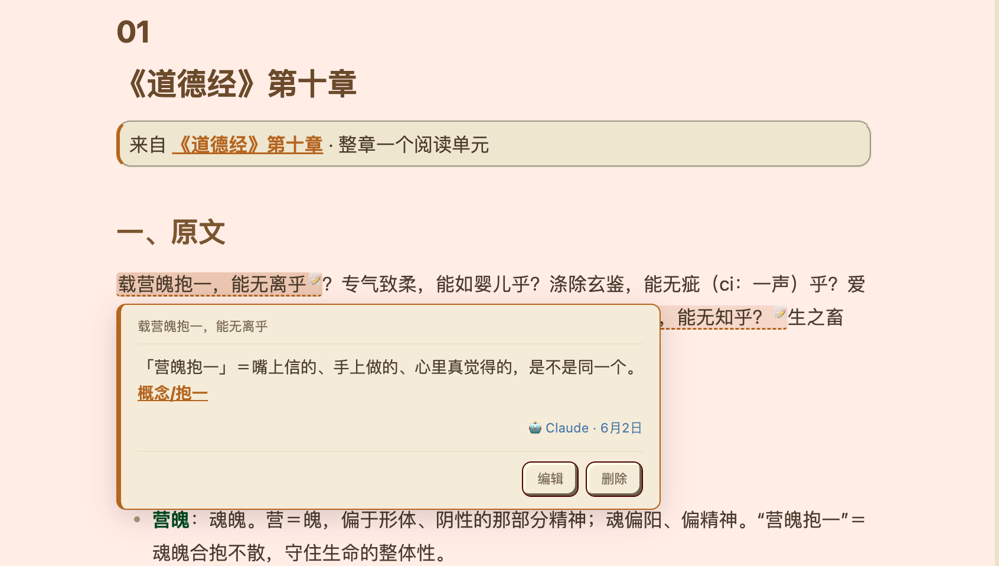

# 更新日志

## v0.1.2 — 2026-06-05

**1. 能给原文写批注笔记了**

读到某句、跟 Claude 聊明白了它的意思，现在可以在obsidian里给那句划线记笔记了——原文一个字不动，agent在你提问携带原文上下文时，会自动识别并写批注笔记，你也可以手动自己写笔记。在阅读模式下， Obsidian 里那句会被高亮，点一下就看到笔记。Claude 和 Codex 里都能用。（批注存进单元旁的 `NN.notes.md`，高亮靠随库自带的 notes-anchor 插件。）

**2. 克隆下来就能在 Obsidian 里读**

笔记库现在自带一套配好的 Obsidian 环境：阅读主题、排版样式、快捷键，还有能在 Obsidian 里直接跟 Claude 对话陪读的 claudian 插件。clone 下来即用，不用自己装配。

**3. 新增「延伸」笔记类别**

读着读着从书里引申出去聊到的其他知识——别的概念 / 理论、想顺手记下的相关书、跨学科的连接——现在有地方收了，归进 `延伸/`，Agent会自动记。

**4. 读着更顺、链接更稳**

精简了笔记索引、收紧了几条陪读规则，并修掉一个会让引用链接断掉的路径写法问题；顺手删掉一份和说明重复的旧文件。

## v0.1.1 — 2026-06-02

**1. 自动提醒**

新增两个钩子（hook），在读书过程的两个节点自动提示，省去手动留意：

- 开始读一个新单元时，提示更新阅读进度；
- 单元读完、进度更新后，提示回看本轮对话，把讨论中的理解整理进 insight 笔记（同一处只提示一次，不重复打扰）。

两个钩子在 Codex 中同样可用。

**2. 溯源链**

insight 写入（含追加）统一要求标注来源原文链接和产出日期，每条 insight 都能直接定位到对应的原文单元，回溯不再断链。

**3. 陪读规则**

精炼了规则措辞，整体更中立、克制；INDEX 重新定位为索引，insight 文件的 frontmatter 去掉了冗余字段。

**4. 非中文书籍适配**

支持非中文原文的书籍——保留原文不删改，逐段逐句插入译文一并陪读。

## v0.1.0 — 2026-05-30

**1. 引用粒度细化到单元**

引用格式从「书 → 章」升级为「书 → 章 → 单元」，并指向原文底本。在 Obsidian 中点击即可跳转到对应原文；已读的《理想国》《道德经》书稿一并回填。

**2. 概念双向链接**

一篇笔记引用某个概念时，概念文件中也会登记这篇笔记的来源，两端互相可达。

**3. 适配其他 Agent 工具**

新增 AGENTS.md（指向 CLAUDE.md）和 `.agents` 目录（指向 `.claude`），让遵循 AGENTS 约定的其他工具读到同一套规则和配置。
