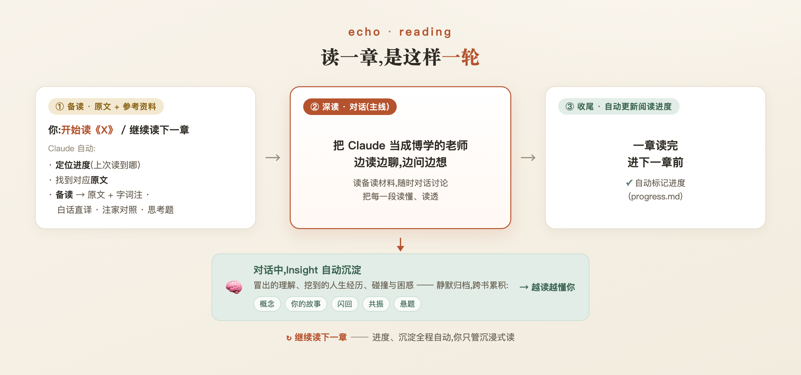

# echo-reading

> 把 Claude 当成你的博学陪读老师,沉浸式读透一本书——进度自动记,理解和回忆自动累积,越读越懂你。

## 这是什么

一个交给 Claude 维护的**对话式深读**笔记本。一本书,你逐段读、说出理解、跟 Claude 聊下去,在一来一回里把它真正读懂、读透,内化成自己的认知。

- 💬 **对话式深读(核心)**——把 Claude 当一位博学的老师:逐段读、随时聊、随时问,陪你把每一段读懂读透。不是替你读,也不替你总结。
- 📌 **进度自动记**——读到哪、想到哪,自动记录;下次说一句「继续读」,接着上回往下走。
- 🧠 **越读越懂你**——对话里冒出的理解、被书照见的人生经历、碰撞与困惑,自动沉淀成 Insight,跨书累积、不断长大。

## 这不是什么

- ❌ 不是**阅读器 / 电子书工具**——重点不是"翻页",是"读懂"。
- ❌ 不是 **chatbot**——它始终围着这本书的真实内容走,不漫聊、不附和、不迎合。
- ❌ 不是**读书笔记 / 内容总结生成器**——不替你"总结一本书",理解得你自己长出来。
- ❌ 不是**书架 / 书籍管理工具**——不为收藏整理,为把一本书真正读进去。

## 适合谁 · 适合读什么

> **适合的书**:哲学、思想经典、宗教与灵性、社科理论、心理与认知、诗歌、文学性散文——这类书"读完"不等于"读懂",每句话、每个观点都值得停下来嚼。
> **适合的人**:愿意慢下来、想把一本书真正内化,也愿意把自己的经历和困惑摆出来一起聊的人。

> **不适合的书**:小说、爽文、人物传记、教材、工具书——以情节或信息为主、读一遍就够、价值在"知道了"而非"嚼透了"。
> **不适合的人**:追求阅读量、只想快速拿到"核心观点 / 这本书讲了啥"的速读者

## 跟直接找 LLM 聊读书,差在哪

把书丢给 LLM 直接聊也能读,但有几处体验是裸LLM给不了的:

| | 直接找 LLM 聊 | echo-reading |
|---|---|---|
| **记得住** | 关掉窗口就忘,下次从零开始 | 进度、聊过的、你的理解都留存,说句「继续读」接着上回走 |
| **会长大** | 每次都是陌生人,聊过的散落各处 | 理解、经历、疑问沉淀进 Insight,跨书累积,越读越懂你 |
| **守原文** | 凭记忆"背"原文,容易记错、张冠李戴、甚至编造 | 原文入库成只读底本,讨论始终基于真实文本,不漂移 |
| **有节奏** | 一股脑给你总结,或要你自己一段段贴 | 自动备读、按最小阅读单元推进,陪你把每段读透,不替你读完 |

一句话:裸 LLM 是「问一次答一次」,echo-reading 是「一本书陪你读到底,而且越读越懂你」。

## 适用于哪些 Agent

为 **[Claude Code](https://claude.com/claude-code)** 打造,规则写在项目根的 [`CLAUDE.md`](CLAUDE.md),Claude Code 启动时自动加载。

仓库同时镜像了一份 `AGENTS.md`(= `CLAUDE.md`),并把 `.agents` 指向 `.claude`——codex，hermes，openclaw等也能读到同一套规则

**推荐配置**：在obsidian里安装claudian插件，使用opus模型，claude当对话窗口，obsidian GUI当阅读器。
## 核心原理:一轮怎么读

一本书入库后(见下「快速开始」),读每一章都是同样的**三阶段循环**:



两件事Agent**全程自动执行、绝不喧宾夺主**:
- 对话里冒出的理解、连接、共鸣、疑问静默沉淀进 `insight/`，读得越多，聊的越多，agent自然会越来越懂你。
- 进度随读随记进 `progress.md`，agent阅读进度与你完全一致，重开会话，隔几天再来读，agent都记得。

## 快速开始

前提:装好 [Claude Code](https://claude.com/claude-code)。导入电子书还需要 Python 3 + 几个库(只在入库时用到):

```bash
pip install EbookLib beautifulsoup4 mobi
```

拿到项目、起 Claude:

```bash
git clone https://github.com/<your-user>/echo-reading.git my-reading
cd my-reading
claude
```

**导入一本书**——把 epub / mobi / azw3 丢给它:

> 导入这本书 〔附上电子书文件〕

Claude 会调用 `book-ingest` skill:看清这本书的结构、判断怎么切,把每一章的**纯原文**提取进 `books/<书名>/chNN/raw.md`,写好 `progress.md`,并把源文件留档。入库只到原文就位为止,然后告诉你共几章、可以读第几章。

> 没有电子书也行:直接说「读《xxx》第 1 章」,Claude 会跟你确认怎么拿到这一章的原文(你贴进来,或放进 `raw.md`)。

## 怎么进行对话式阅读

顺着上面那三阶段走,你要做的只是**开口**:

### ① 开始读 / 继续读 →「备读」

> 开始读《xxx》 ・ 继续读《xxx》下一章

Claude 定位进度、取原文。如果这一章还没备读过,会先调用 `chapter-split` skill 把它切成若干**阅读单元**(短章一个 `01.md`;长章切多个单元,再加一份卷层面的 `00-导读.md`),每个单元铺成固定的 9 段结构(原文 + 注疏/译文,第 8·9 段留白给你),然后开始备读第一个单元。

### ② 边读边聊,把一段读透 →「深读 · 对话」主线

读完一个单元,把 Claude 当成博学的老师——有不懂、不服、有联想,都说出来或直接问:

> 这段我理解成 ……,对吗 ・ 这里为什么是这个意思 ・ 这两家注解冲突,你怎么看

一来一回,把这一段读透。讨论里自然冒出的理解会自动沉淀进 `insight/`,你不必操心。

### ③ 读完 →「收尾」

一个单元 / 一章读完,进度自动勾选、补一句回看,接着读下一章——回到 ①。

### 更多用法

不止顺着读,你随时可以:

- **带一段人生经历/困惑/抉择来叩书**(反向):`我最近遇到一件事,跟之前读的有关吗,我应该怎么做` —— Claude 先扫 Insight 找相关条目,再把书的视角端给你,一起分析,帮你捋清思路和视角。
- **让它记一笔**:`记下来` / `存一份` —— 立刻归档进 Insight。
- **回看体检**:`lint` —— 检查进度、哪些悬题被生活答了、孤立反链、长期没回看的章节(只报告,不擅自改)。

## 目录结构

```
books/<书名>/            ← 原文层 · 事实,永不改写
  ├── progress.md        阅读进度(章 → 阅读单元 两层)
  ├── <源文件>.epub      入库时留档的电子书
  └── chNN/              一章一目录
        ├── raw.md         这章纯原文(只读底本)
        ├── 00-导读.md     长章才有 · 卷/章层面入口
        └── NN.md          一个阅读单元一文件 · 9 段结构

insight/                 ← 衍生层 · 对话里长出来,跨所有书共享
  ├── INDEX.md           主干:所有条目骨架,每条一行
  ├── 概念/              核心概念的工作定义
  ├── 你的故事/          你的真实经历被书照见
  ├── 闪回/              经历 × 书的观点 融汇出的洞察
  ├── 共振/              击中感受 / 情绪的瞬间
  └── 悬题/              当下不解、带着读下去的问题
```

真实样子:《道德经》81 章(短章,各一个单元)、《理想国》第一卷已切成 10 个阅读单元——都在 `books/` 下。详细规则在 [`CLAUDE.md`](CLAUDE.md) 和 [`insight/README.md`](insight/README.md),Claude 启动时自动加载。

> Insight 之间用 `[[wiki 链接]]` 互相牵连,可以直接用 [Obsidian](https://obsidian.md) 打开这个库,点链接在原文、单元、条目之间跳。

## 设计原则

- **两层分离**:`books/` 只读(不写衍生分析),`insight/` 只长(不写原文)。
- **跨书共享**:所有书共用一份 `insight/`,同一段经历可能被多本书照见。
- **理解为主,记录为副**:把书读透是目的,沉淀是副产品——颠倒就走偏。
- **进度半自动**:进入新单元时后台 hook 会提醒核对 `progress.md`,不用你惦记。

## License

MIT
